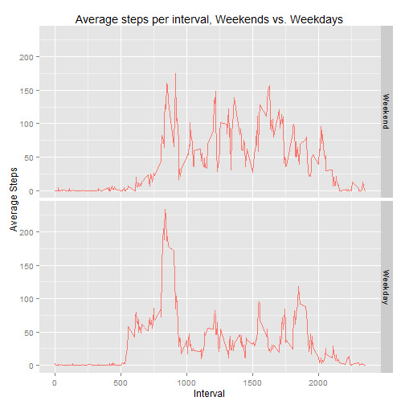

This project is for the Reproducible Research Coursera course. The guidlines for this project can be found on (GitHub)[https://github.com/rdpeng/RepData_PeerAssessment1].

## Loading and preprocessing the data
First, we need to load in the data. We check to see if the file has been unzipped, and if not, we do so.  Next, load the data and make sure it's sorted by date and time.

```r
setwd("~//dataScience/reproducibleResearch/RepData_PeerAssessment1/")

if(!file.exists('activity.csv')){
       unzip('activity.zip')
}
activityData <- read.csv('activity.csv', colClasses = c('integer', 'Date', 'integer'))
activityData <- activityData[order(activityData[,2], activityData[,3]),]
```


## What is mean total number of steps taken per day?
For this section we want to:

1. create a histogram of the total number of steps taken each day,  
5. calculate the mean steps per day, and
3. calculate the median steps per day.

To calculate the total steps per day, I aggregate the data by date and find the sum, and then make a histogram of those step counts.

```r
totalSteps <- aggregate(steps ~ date, activityData, FUN=sum)

hist(totalSteps$steps, xlab="Steps per day", main="Total Daily Steps", breaks=10)
```

 

Next, we need to calculate the mean and the median, which are done with their respective functions.

```r
mean(totalSteps$steps)
```

```
## [1] 10766.19
```

```r
median(totalSteps$steps)
```

```
## [1] 10765
```

## What is the average daily activity pattern?
For this aspect of the project, we need to:

1. plot the average number of steps per daily interval, and
2. determine which average interval had the greatest number of steps.

Again, we will use the `aggregate()` function, this time combining the steps by interval and taking finding the mean. We then plot that as a line graph.


```r
intervalAvg <- aggregate(steps ~ interval, activityData, FUN=mean)
plot(x=intervalAvg$interval, y=intervalAvg$steps, type='l', xlab="Daily Interval", ylab="Average Steps", main="Average Steps per Daily Interval")
```

 

We then want to find the interval with the highest avg step count. 

```r
max(intervalAvg$steps)
```

```
## [1] 206.1698
```

Using the `which.max()` function, we can calculate which interval had the highest average count.

```r
intervalAvg[which.max(intervalAvg$steps), 1]
```

```
## [1] 835
```

This shows that the most steps were averaged at 8:35 AM, which is clearly visible by the one large peak.

## Imputing missing values
For this part of the project, we need to:

1. Calculate the total number of missing days,
2. Come up with a strategy to fill in those missing data points,
3. Create a new dataset w/ those data, and
4. Create a histogram w/ those new data, calculating the new mean and median.

First we need to see what data is missing as a whole using


```r
sum(!complete.cases(activityData))
```

```
## [1] 2304
```

Next, to see which data in particular is missing, we can sum the `is.na()` for each column in `activityData`. 


```r
missingActivity <- c(sum(is.na(activityData$steps)), sum(is.na(activityData$date)), sum(is.na(activityData$interval)))
missingActivity
```

```
## [1] 2304    0    0
```

These results show us that the only missing data is the steps taken, and not the date or interval data. Next we need to determine how the data is missing: is it random intervals without data or is the data missing for entire days. We will create a vector hodling the missing data indices using `is.na()` and then aggregate that data according to date. 

```r
missing <- is.na(activityData$steps)
missingIntervals <- aggregate(missing ~ date, activityData, FUN=sum)
as.factor(missingIntervals$missing)
```

```
##  [1] 288 0   0   0   0   0   0   288 0   0   0   0   0   0   0   0   0  
## [18] 0   0   0   0   0   0   0   0   0   0   0   0   0   0   288 0   0  
## [35] 288 0   0   0   0   288 288 0   0   0   288 0   0   0   0   0   0  
## [52] 0   0   0   0   0   0   0   0   0   288
## Levels: 0 288
```

The levels of the data are `0` or `288`, and `288` is the total number of intervals for a full day's readings as seen by `12 intervals/hour * 24 hours/day = 288 intervals/day`. Since full days data are missing, we can take simplet approach and repalce those days data with the either the mean or median from the days in the rest of the data set.

First, I'll create a copy of the initial data frame as to not overwrite the original data. Wherever there is a missing step day, I will replace each `NA` with the median number of steps divided by 288, as calculated by `median(totalSteps$steps)/288`.

```r
activityDataMod <- activityData
activityDataMod[is.na(activityDataMod$steps), 1] <- median(totalSteps$steps)/288
table(complete.cases(activityDataMod))
```

```
## 
##  TRUE 
## 17568
```

Again, as in step 2, we will plot the histogram and calculate the mean and median.  


```r
totalStepsMod <- aggregate(steps ~ date, activityDataMod, FUN = sum)
hist(totalStepsMod$steps, xlab="Steps per day", main="Total Daily Steps (modified NA)", breaks=10)
```

 

```r
mean(totalStepsMod$steps)
```

```
## [1] 10766.03
```

```r
median(totalStepsMod$steps)
```

```
## [1] 10765
```

Since we added the median number of steps back to each missing day, it is no surprise that the mean & median did not change from the original, unmodified data.

## Are there differences in activity patterns between weekdays and weekends?
Lastly, we want to see the differences between patterns in the weekdays vs weekend days. Specificlly we need to:

1. create a factor variable categorizing the day as a weekday or weekend, and 
2. plot both weekdays and weekend averages per interval.


```r
library(ggplot2)
```

```
## Warning: package 'ggplot2' was built under R version 3.1.3
```

```r
mtwtf <- weekdays(activityData$date) %in% c("Monday", "Tuesday", "Wednesday", "Thursday", "Friday")
weekday <- factor(x = mtwtf, labels=c("Weekend", "Weekday"))
averageSteps <- aggregate(steps ~ interval + weekday, activityData, FUN=mean)
qplot(interval, steps, 
      data=averageSteps, 
      facets =  weekday ~ ., 
      geom=("line"), 
      color="cyn", 
      main="Average steps per interval, Weekends vs. Weekdays", 
      xlab = "Interval", 
      ylab = "Average Steps") + theme(legend.position = "none")
```

 

Based on this output we can see some slight differences. Generally speaking, the people wearing these activity trackers rise earlier and begin their activity earlier on weekdays than on weekends. We can also witness their commute to work, but then there is a marked decrease in activity upon arriving there. After 10:00 am, the participants generally move more on weekends (peaks ~ 150 steps per interval) compared to weekdays (peaks ~ 100 steps per interval. We also see that people stay out later on weekends than on weekdays.
